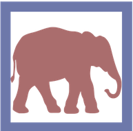
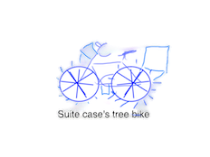

## Welcome To SuiteCase's Tree Bike Page 

### *I want to tell you about my tree bike.*

_This is a bike that climbs up a tree.    
I put some tree sap to the hinges so it has more grip to climb.  
It has special wheels with extra grip so it won't slip_

_To get thrust to go up the tree I have a sap engine attached.   
The seat cover my bike is made of Myrtle  tree bark.    
It has a light, special break, a calendar, and a GPS.    
I have jewels and stickers that I put on the bike to make it shine._

_Also I have a control center. It can smell nummy.    
I have a bag controlled by the control center to fill the nummy.    
It has tree mode and land mode.   
On the calendar I have events planned for each day.   
GPS helps to go different destinations and events._ 

**My bike is ready**

**Why I have tree bike is to get  nummy, it is a yummy food my friend chingi eats, that he keeps on the tree top.**   

***The End***
                                      
                                     

<b>Image Credits - Sketch By SuiteCase</b>

  

*Hope you like the story.  
Thank you for visiting my page.*

